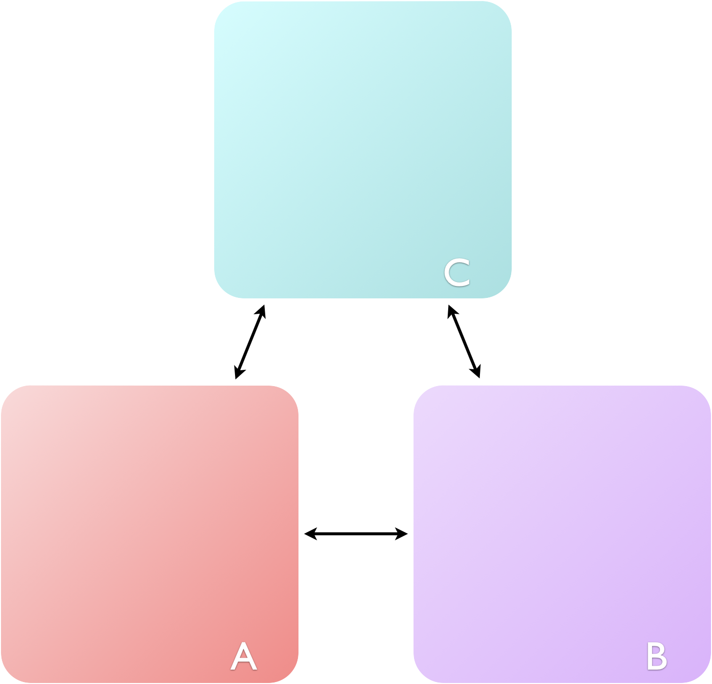

# Week 1  - Part 2 {#ch:Part2}

There are different methods of teaching thermodynamics, many come at the problem from a very mathematical viewpoint, with partial derivatives, and operators. This course does not do that, the emphasis here is on understanding thermodynamic concepts, and being able to apply them solve problems. At no point  will I expect you to be able to derive something, and I only include the derivations of a couple of equations where I feel it aids understanding of the concept.

If you wish to see a more mathematical version of this course it is covered in a number of textbooks, including the recommended text for this course, Atkin's Elements of Physical Chemistry.

## Zeroth Law of Thermodynamics {#sec:zeroth}

There are four laws of thermodynamics, each introduces a thermodynamic concept. The first of these laws was actually the last to be defined and is called the *zeroth law*.

The zeroth law deals with the idea of thermal equilibrium, and leads to the concept of *temperature*.

```{r echo=FALSE, zerothlaw, out.width='50%', fig.show='hold', fig.align='center', fig.cap='The zeroth law of thermodynamics states: if A is in thermal equilibrium with B, and B is in thermal equilibrium with C, then C will be in thermal equilibrium with A.'}

```

<div style="text-align: center;"><iframe width="847" height="476" src="https://www.youtube.com/embed/exynAqHlHyA" frameborder="0" allow="accelerometer; autoplay; clipboard-write; encrypted-media; gyroscope; picture-in-picture" allowfullscreen></iframe><div style="text-align: left;">

<div style="text-align: left;">

The thermal equilibrium used in figure @\ref(fig:zerothlaw) basically says that if A and B are in thermal equilibrium then they must have the same temperature. Therefore the first thermodynamic concept we meet is temperature, which has the unit K (kelvin).

<span style="color: deeppink;"> *The following video is for context and interest only*

<div style="text-align: center;"><iframe width="847" height="476" src="https://www.youtube.com/embed/3Y8gaAwcJg8" frameborder="0" allow="accelerometer; autoplay; clipboard-write; encrypted-media; gyroscope; picture-in-picture" allowfullscreen></iframe>

<div style="text-align: left;">

<span style="color: black;">
<div style="text-align: left;">
## What is temperature?

<div style="text-align: left;">You are already familiar with teh Maxwell-Boltzmann distribution, and have seen that the mean speed of a gas particle depends only upon the mass of that particle and the temperature (figure \@ref(fig:boltzmann)).

```{r echo=FALSE, boltzmann, out.width='80%', fig.show='hold', fig.align='center', fig.cap='The distribution of speeds of a gas depends only upon temperature and molecular mass. At low temperatures the mean speeds of particles are lower than those at high temperatures.'}
knitr::include_graphics("images/boltzmann.png")
```

Therefore there is fundamental link between 'speed' and temperature. In Section \@ref(sec:classicalstat) you were introduced to the concept of energy levels in molecules. If you recall all energy levels are quantised, and translational energy levels have the closest spacing (figure \@ref(fig:energylevels)). The faster a molecule moves the higher the translational energy level it occupies.

```{r echo=FALSE, energylevels, out.width='80%', fig.show='hold', fig.align='center', fig.cap='The energy levels within molecules have different gaps between levels, translational levels are very closely spaced, rotational energy levels have the next closest spacing, vibrational levels are higher in energy still, finally electronic levels have the largest energy gaps.'}
knitr::include_graphics("images/energylevels.png")
```

The relative populations of these energy levels is given by the Maxwell-Boltzmann equation:

\begin{equation}
\frac{N_i}{N_j}=\frac{g_i}{g_j} \textrm{e}^{-\frac{\Delta E}{k_B T}}
(\#eq:maxwell)
\end{equation}

Looking at equation \@ref(eq:maxwell) we can see that the relative population of energy levels depends upon ΔE, the energy gap between them. This means that the closely spaced translational energy levels are well populated and the particles have a range of speeds associated with this.

At very low temperatures only translational levels are populated, but as the temperature increases and the energy is distributed over more levels rotational levels are then populated, then finally vibrational, at room temperature only there is only a negligible probability of vibrational energy levels being populated. 


```{r echo=FALSE, approachingzero, out.width='80%', fig.show='hold', fig.align='center', fig.cap='As the temperature is decreased the probability of finding particles in the ground translational state increases. At absolute zero all molecules will be in the ground translational state. '}
knitr::include_graphics("images/approachingzero.png")
```

Therefore temperature is a measure of the population of energy levels within a molecule.

<div style="text-align: center;"><iframe width="847" height="476" src="https://www.youtube.com/embed/3JADfdS8z3k" frameborder="0" allow="accelerometer; autoplay; clipboard-write; encrypted-media; gyroscope; picture-in-picture" allowfullscreen></iframe><div style="text-align: left;">


## Internal energy, U

Internal energy is a state function (equation \@ref(eq:internal)), which describes the 'total internal energy' of a system. We are already aware that there is thermal energy within the system from the population of the energy levels as described in figure \@ref(fig:energylevels). However internal energy also accounts for the 'potential energy' from the inter- and intra- molecular interactions between particles in the system (figure \@ref(fig:internalenergy)).

```{r echo=FALSE, internalenergy, out.width='80%', fig.show='hold', fig.align='center', fig.cap='The internal energy of a system is the sum of the kinetic and potential energies of the particles in the system.'}
knitr::include_graphics("images/internalenergy.png")
```

<div style="text-align: center;"><iframe width="847" height="476" src="https://www.youtube.com/embed/TCwvOeKme30" frameborder="0" allow="accelerometer; autoplay; clipboard-write; encrypted-media; gyroscope; picture-in-picture" allowfullscreen></iframe><div style="text-align: left;">

Since internal energy is a state function the change in internal energy in a process is given by the difference in internal energy of the final and initial states (equation \@ref(eq:internal)).

\begin{equation}
\Delta U = U_\textrm{f} - U_\textrm{i}
(\#eq:internal)
\end{equation}

### Degrees of Freedom 

<span style="color: deeppink;">NOTE - I've also added this to the week1 part1 so this section is duplicated.

Perhaps unsurprisingly the structure of molecules is an important concept when we consider thermodynamics from the molecule up perspective, but perhaps surprisingly classical thermodynamics does not care at all the structure of the molecules in the system we are considering.

```{r echo=FALSE, atomdegrees1, out.width='50%', fig.show='hold', fig.align='center', fig.cap='Every atom has three degrees of freedom, these are movement along the x, y and z axis.'}
knitr::include_graphics("images/atomdegrees.png")
```

When atoms combine to form moleucules the total number of degrees of freedom must be conserved, and so new types of degrees of freedom are introduced, namely molecular rotations and molecular vibrations (figure \@ref(fig:typesdegree1), and equations \@ref(eq:lineardof1) and \@ref(eq:nonlineardof1)).

```{r echo=FALSE, typesdegree1, out.width='80%', fig.show='hold', fig.align='center', fig.cap='Translations, molecular rotations and molecular vibrations are all degrees of freedom.'}
knitr::include_graphics("images/typesdegree.png")
```

For linear molecules there are three translational degrees of freedom, two rotational degrees of freedom (figure \@ref(fig:linear1)) and the number of vibrational degrees of freedom is given by equation \@ref(eq:lineardof1), where N is the total number of atoms in the molecule:

\begin{equation}
x = 3N-5
(\#eq:lineardof1)
\end{equation}

```{r echo=FALSE, linear1, out.width='80%', fig.show='hold', fig.align='center', fig.cap='In linear molecules there are only two rotational degrees of freedom as rotaion around the z-axis (the long axis of the molecule) are equivalent and therefore dont contribute to the degrees of freedom.'}
knitr::include_graphics("images/linear.png")
```

For non-linear molecules there are three translational degrees of freedom, three rotational degrees of freedom and the number of vibrational degrees of freedom is given by equation \@ref(eq:nonlineardof1), again where N is the total number of atoms in the molecule:

\begin{equation}
x = 3N-6
(\#eq:nonlineardof1)
\end{equation}

<div style="text-align: center;"><iframe width="847" height="476" src="https://www.youtube.com/embed/s4lfDeoPo5Y" frameborder="0" allow="accelerometer; autoplay; clipboard-write; encrypted-media; gyroscope; picture-in-picture" allowfullscreen></iframe><div style="text-align: left;">

<div style="text-align: left;">
### Equipartition theory {#subsec:equipartition}

<div style="text-align: left;"><span style="color: deeppink;">*Some of the material covered in this video relates to heat capacities which we will study in more detail later in the course.*

Equipartition theory is quite involved, and I am not going to explain any of the actual theory or derivation in this course, instead we are going to just use the results of this theory.

These results from statistical thermodynamic calculation, are verified by emperical observations which is proof of the power of Boltzmann's theories.

Equipartition theory says that for an ideal gas each degree of freedom contributes $\frac{RT}{2}$ to the molar internal energy, and so for monatomic gases, such as helium and neon the internal energy , U is $\frac{3RT}{2}$. However for a diatomic gas with 6 degrees of freedom (3 translational, 2 rotational and 1 vibrational) the internal energy of the ideal gas is predicted to be $3RT$.

However, we have already seen that the energy spacing between different types of energy level differs, and so only *active* degrees of freedom contribute to the internal energy. Consequently because there are large energy gaps for vibrational energy levels the excited states of these energy levels are rarely occupied and so they do not contribute towards the total internal energy of the system.

<div style="text-align: center;"><iframe width="847" height="476" src="https://www.youtube.com/embed/9ZDO7KEyQ3g" frameborder="0" allow="accelerometer; autoplay; clipboard-write; encrypted-media; gyroscope; picture-in-picture" allowfullscreen></iframe><div style="text-align: left;">


<div style="text-align: left;">
## First Law of Thermodynamics

</iframe><div style="text-align: left;">There are a number of variations on the statements of the first law of thermodynamics, but ultimately they are all saying the same thing. The variations come from different definitions referring to different types of thermodynamic system (Section \@ref(sec:typesofsystem)).

The first statement of the first law of thermodynamics is the most fundamental:

<div style="text-align: center;"><span style="color: deeppink;">*‘the internal energy of an isolated system is constant’*<div style="text-align: left;"><span style="color: black;">

<span style="color: black;">This should be fairly obvious, if my system is isolated there can be no exchange of matter or energy and so the internal energy can't change.

<span style="color: black;">A second version of first law refers to a closed system, one where there can be no exchange of matter, but energy may be exchanged in the form of either heat or work. Mathematically this statement is (\@ref(eq:firstlaw)):

\begin{equation}
\Delta U = q + w
(\#eq:firstlaw)
\end{equation}

<span style="color: black;">where $q$ is the energy exchanged in the form of heat and $w$ the energy exchanged in the form of work.

<div style="text-align: center;"><iframe width="847" height="476" src="https://www.youtube.com/embed/JY6DfuWokjU" frameborder="0" allow="accelerometer; autoplay; clipboard-write; encrypted-media; gyroscope; picture-in-picture" allowfullscreen></iframe><div style="text-align: left;">

<div style="text-align: left;">

## Questions
<div style="text-align: left;"><span style="color: black;">
1. <span style="color: black;">Determine the number of degrees of freedom in each of the following molecules, and consequently predict the molar internal energy at 25 ºC.

a. molecular nitrogen, N~2~
a. ozone, O~3~
a. acetylene HCCH

2. Why can't you use equipartition theory to determine the internal energy of ethanol at room temperature?

3. If a system looses 250 J of energy from loss of heat, and 600 J of energy is added to the sytem in the form of work what is the change in internal enery of the system, and the universe?

4. How does changing the spacing of energy levels change the distribution of population of energy levels in a system?

## Answers

1. -
a. 6.194 kJ mol^−1^
a. 7.433  kJ mol^−1^
a. 6.194 kJ mol^−1^

2. It's a liquid at room temperature, equipartition theory tells us about ideal gases.

3. $\Delta U_{system}=$ +350 J, $\Delta U_{universe}=$0J

4. It shouldn't they will respace, so if the population of levels is higher when the space is bigger, but you are just distributing the energy differently.
