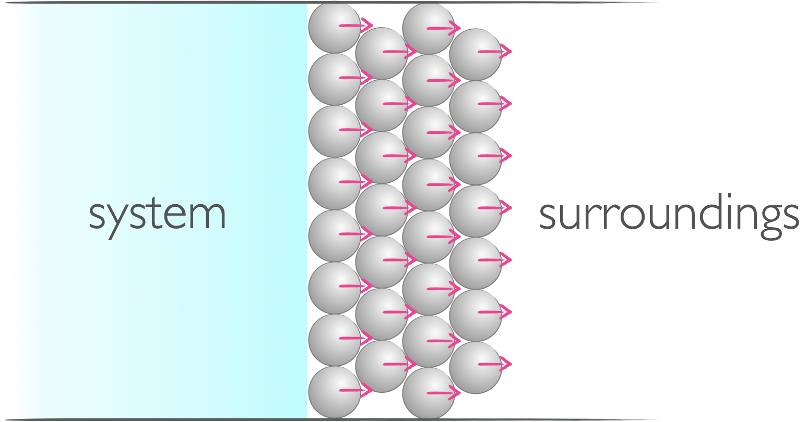
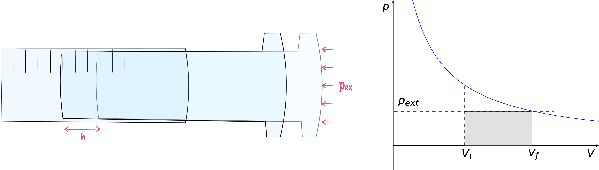
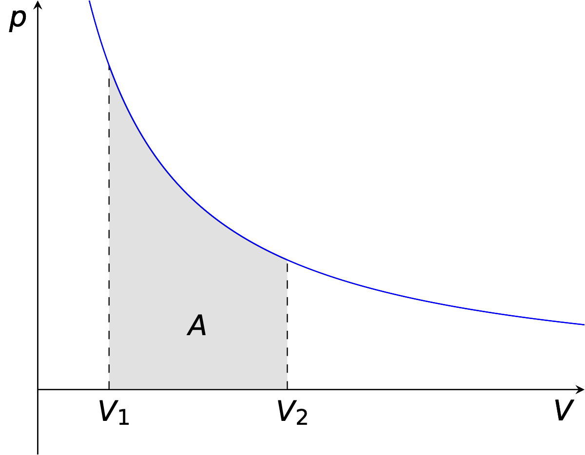
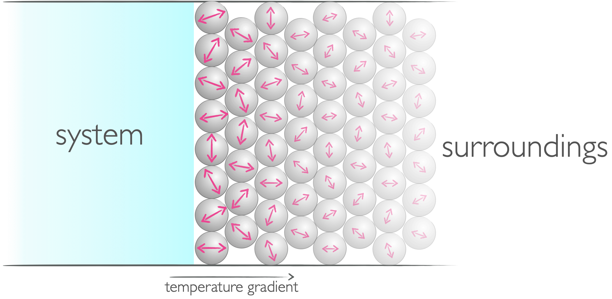
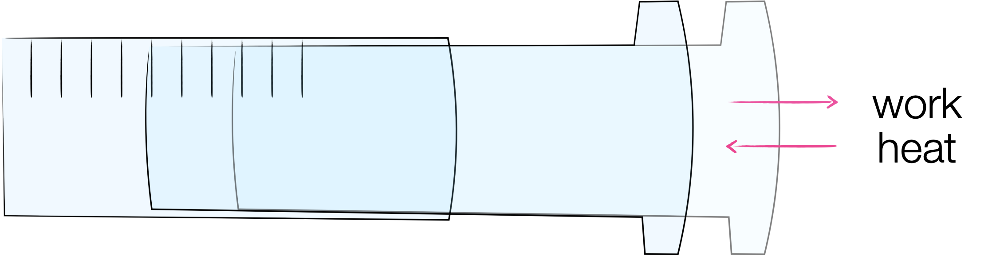

# Week 2  - Part 1 {#ch:Part3}

Previously we have been introduced to the concepts of temperature and internal energy, two fundamental concepts in thermodynamics, and we finished by introducing the first law of thermodynamics, and introducing the terms 'heat' and 'work'. In this part we learn what heat and work are thermodynamically, and extend our idea of state functions to bring the well known concept of Hess' Law to this course.

The unit of energy is joule, this is named after one of the pioneers of thermodynamics.

*The following video has been added for some context to the material, it is not core to the course and the material in it is not examinable.*

<iframe width="847" height="476" src="https://www.youtube.com/embed/cNTvhqEj7AE" frameborder="0" allow="accelerometer; autoplay; clipboard-write; encrypted-media; gyroscope; picture-in-picture" allowfullscreen></iframe>

## Work, w {#sec:work}

In thermodynamics the term 'work' describes a mode of transfer of energy between the system and surroundings, this transfer of energy achieves a uniform motion. Work is sometimes considered to be useful energy because this uniform motion may be used to move a piston, lift a weight in a gravitational field or power a phone.

```{r echo=FALSE, work, out.width='50%', fig.show='hold', fig.align='center', fig.cap='When energy is transfered in the form of work there is a uniform change in the system or surroundings.'}

```

If we consider the expansion of a gas in a piston against a constant external pressure the gas will expand until the pressure inside and outside of the piston are the same (figure \@ref(fig:irrevexpansion)). The work done in this process is given by equation \@ref(eq:irrevexpansion), and shown as the shaded area in figure \@ref(fig:irrevexpansion).

```{r echo=FALSE, irrevexpansion, out.width='100%', fig.show='hold', fig.align='center', fig.cap='If a gas expands against a constant external pressure the expansion will continue until the pressure inside and out of the piston is the same.'}

```

\begin{equation}
w=-p_{\textrm{ex}}\Delta V
(\#eq:irrevexpansion)
\end{equation}

The work done, is negative because if the system does work on the surroundings energy is transferred from the system to the surroundings and the internal energy of the system falls.

You can check the units of this process to help verify this statement, pressure has the units pascal, Pa, which in SI base units is kg m^−1^ s^−2^ and volume of course m^3^. The units of work are joules, J, which in SI base units is kg m^2^ s^−2^.

If we instead consider the hypothetical thermodynamically reversible process where the system and surroundings are in equilibrium all through the expansion, this tells us the maximum possible work which can be achieved from a system.

```{r echo=FALSE, revexpansion, out.width='50%', fig.show='hold', fig.align='center', fig.cap='If a gas expands and the pressure inside and out are only ever infitessimal difference between the pressure of system and surroundings this is called a reversible expansion and the maximum possible amount of work can be achieved.'}

```

In the case of a reversible expansion the work done by the system in an expansion is given in equation \@ref(eq:revexpansion), this expression may be derived from integrating the area under the pV curve in figure \@ref(fig:revexpansion).

\begin{equation}
w=-n\textrm{R}T \ln {\frac{V_\textrm{f}}{V_\textrm{i}}}
(\#eq:revexpansion)
\end{equation}

<iframe width="847" height="476" src="https://www.youtube.com/embed/lpi76wGjEJc" frameborder="0" allow="accelerometer; autoplay; clipboard-write; encrypted-media; gyroscope; picture-in-picture" allowfullscreen></iframe>

For the same increase in volume at the temperature of the system increases then the work needed in a reversible expansion also increases.

There are many types of work, but they may all be modeled by expansion work. Other types of work include things like surgace expansion, extension of a spring or electrical work.

## Heat, q {#sec:heat}

If you recall the definition of a closed system (section \@ref(subsec:closed)), we introduced the concept of energy being able to be exchanged in the form of heat through a diathermic wall, this is just a boundary through which energy in the form of heat may be transferred.

Heat is defined as a mode of transfer of energy that achieves a random motion in the surroundings.

```{r echo=FALSE, heat, out.width='50%', fig.show='hold', fig.align='center', fig.cap='When energy is transfered in the form of heat it induces a random motion in the system or surroundings.'}

```

- When a reaction is exothermic energy in the form of heat is transferred from the system to the surroundings and the internal energy of the system falls (q = -ve).

- When a reaction is endothermic energy in the form of heat is transferred from the surroundings to the system  and the internal energy of the system increases (q = +ve).

<iframe width="847" height="476" src="https://www.youtube.com/embed/kIDmAO6SMow" frameborder="0" allow="accelerometer; autoplay; clipboard-write; encrypted-media; gyroscope; picture-in-picture" allowfullscreen></iframe>

### Isothermal reversible expansion

If a gas is allowed to expand and no heat is transferred then the work done by the system allows the temperature of the system to fall.

```{r echo=FALSE, isothermalexpansion, out.width='50%', fig.show='hold', fig.align='center', fig.cap='In the case of an isothermal reversible expansion the work done by the system and the heat transferred to the system exactly balance.'}

```

There is a special case where we can consider the expansion of a gas but energy is transferred from the surroundings to the system in the form of heat. In this isothermal reversible expansion the work done by the system is exactly equal an opposite to the heat transferred to the system, and so the net change in internal energy is zero.

Therefore, by applying this to equation \@ref(eq:revexpansion), we can see for an isothermal reversible expansion:

\begin{equation}
q=n\textrm{R}T \ln {\frac{V_\textrm{f}}{V_\textrm{i}}}
(\#eq:isothermalexpansion)
\end{equation}

This is just an example of the first law of thermodynamics in action.

## Enthalpy, H

The enthalpy of a system is given by:

\begin{equation}
H = U+pV
(\#eq:enthalpy)
\end{equation}

at constant pressure the enthalpy change of a system is given by:

\begin{equation}
\Delta H = \Delta U + p\Delta V
(\#eq:enthalpychange)
\end{equation}

Fundamentally enthalpy is a way of keeping track of internal energy when we are working in systems which are at constant pressure, systems which are allowed to do expansion work against the atmosphere.

If we take both our original definitions of enthalpy and internal energy we can bring enthalpy back to a concept I am sure you are all familiar. That being heat:

\begin{equation*}
\Delta H = \Delta U + p\Delta V
\end{equation*}

and

\begin{equation*}
\Delta U = w + q
\end{equation*}

then

\begin{equation*}
\Delta H = w + q + p \Delta V
\end{equation*}

Therefore:

\begin{equation}
\Delta H_p = q
(\#eq:enthalpyconstp)
\end{equation}

Consequtnly at 25 ºC the molar enthalpy of an ideal gas is about 2.5 kJ mol^−1^


<div style="text-align: center;"><iframe width="560" height="315" src="https://www.youtube.com/embed/vqGXc-i5thQ" frameborder="0" allow="accelerometer; autoplay; clipboard-write; encrypted-media; gyroscope; picture-in-picture" allowfullscreen></iframe><div style="text-align: left;">
</iframe><div style="text-align: left;">
## Hess's Law

Just like internal energy, enthalpy is a state function, and the relationship between the enthalpy of a reaction is just the difference in enthalpy of the final and initial states.

Hess' law (equation \@ref(eq:enthalpystate1))is just application of the nature of enthalpy being a state function:

\begin{equation}
\Delta_r H^{\ominus} = \sum_{products}v \Delta H^{\ominus}_\textrm{X}-\sum_{reactants}v \Delta H^{\ominus}_\textrm{X}
(\#eq:enthalpystate1)
\end{equation}

If the enthalpy of reaction is positive the reaction is endothermic heat is transferred from the surroundings to the system and the temperature of the surroundings falls, if the enthalpy of reaction is negative the reaction is exothermic heat is transferred from the system to the surroundings and the temperature of surroundings increases.

### Constant volume and constant pressure

This is just to highlight that at constant volume the system cannot expand and therefore no work can be done, consequently $\Delta U_V = q$.

At constant pressure the work done, $-p \Delta V$ means that the change in enthalpy ($\Delta H = \Delta U + p \Delta V$) is given by $\Delta H_p=q$.

## Questions

1. When exactly one mole of an ideal gas is ‘heated’ with 1.75 kJ of energy, it expands doing 250 J of work. What is the change in internal energy of the gas?

2. Suppose we have two otherwise identical calorimeters, one calorimeter of fixed volume (isochoric) and the other calorimeter of fixed pressure (isobaric). If exactly the same amount of substance was burnt in excess oxygen in each, which would record the highest temperature change in the surroundings?

- it would be the same in each
- the isochoric system
- the isobaric system
- not enough information to determine

3. Calculate the standard enthalpy of formation of $N_2 O_5$ from the following data:

$2 NO_{(g)} + O_{2(g)} \longrightarrow 2 NO_{2(g)}$   $\Delta _r H^\ominus = -114.1$ kJ mol$^{-1}$

$4 NO_{2(g)} + O_{2(g)} \longrightarrow 2 N_2 O_{5(g)}$   $\Delta _r H^\ominus = -110.2$ kJ mol$^{-1}$

$N_{2(g)} + O_{2(g)} \longrightarrow 2 NO_{(g)}$   $\Delta _r H^\ominus = +180.5$ kJ mol$^{-1}$

4. Calculate the expansion work done on the system when 9.576 g of solid ammonium chloride, NH_4_Cl, decomposes completely to yield gaseous ammonia, NH3 and hydrogen chloride, HCl at a temperature of 1,410 K. Treat the expansion as irreversible and the gases formed as perfect.

5. What is the maximum amount of work available when 1 mole of a gas doubles in volume at 25$^\circ$C?
- How does this change with increasing temperature?
- If the expansion is isothermal how much heat is added to the system?
## Answers

1. + 1.50 kJ
2. not enough infomation to determine, we would need to know if the net change in gas molecules of the system is postive or negative.
3. $Δ_fH^\ominus$ = +11.3 kJ mol^−1^ per mole of N~2~O~5~
4. w = -4.198 kJ
5. w = −1.72 kJ, increases, q=  -w = +1.72 kJ.
