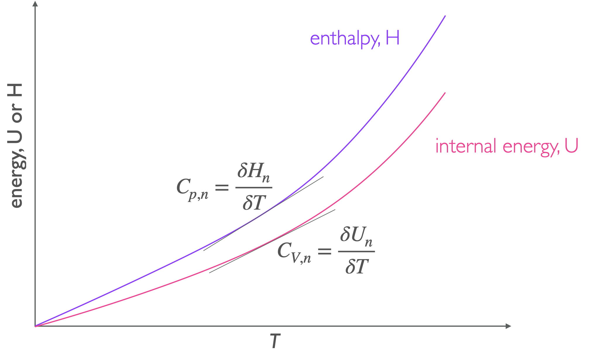
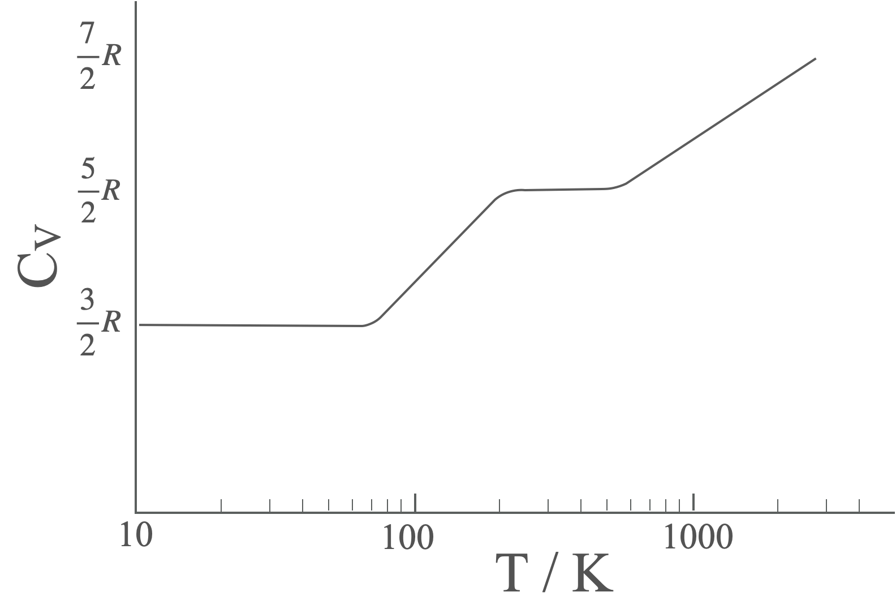
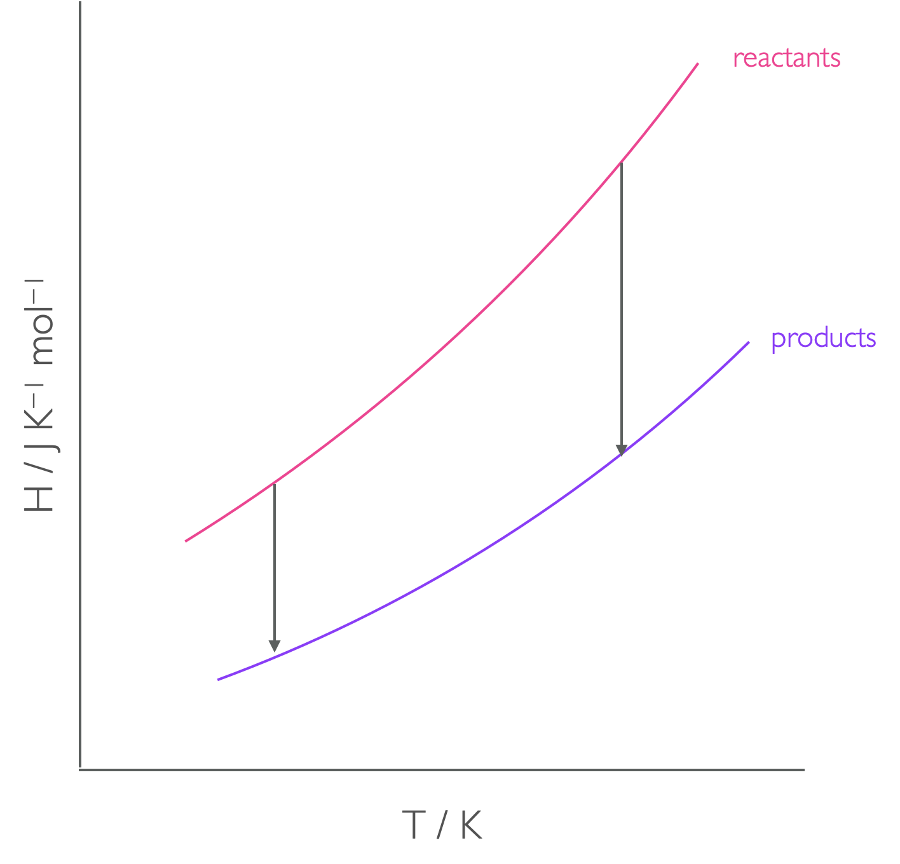
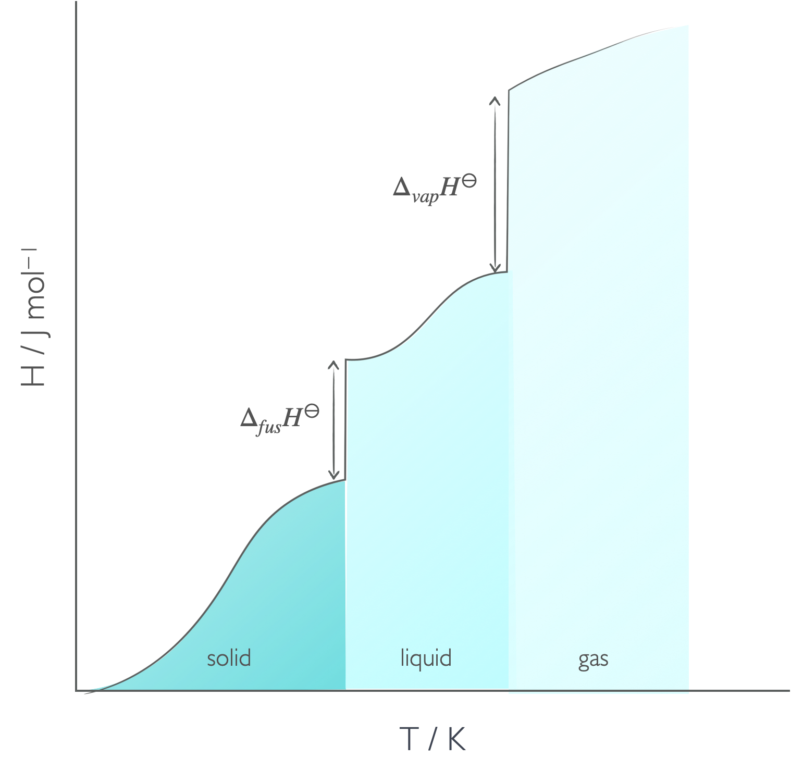

# Week 2  - Part 2 {#ch:Part4}

## Heat capacity, C~X~

The heat capacity of a material is the amount of energy required to raise the temperature of that material by 1 K, however there are many different versions of heat capacity, covering both entensive an intensive properties.

Perhaps more confusingly when looking at gases we have to consider whether the heat capacity of a material is at constant pressure or constant volume. This is because if we are at consant pressure the gas has to do work in expanding, and so heat capacitites at constant volume are always smaller than those at constant pressure.

Heat capacity varies with temperature, we can usually say values will be constant within about 100 K, but numerous measurements have been used to show that the heat capacity varies with temperature as follows:


```{r echo=FALSE, heatcapacitypV, out.width='70%', fig.show='hold', fig.align='center', fig.cap='The heat capacity of a material is the gradient of the line on an energy verses temperature plot.'}

```

\begin{equation}
C_{p,n}=\textrm{a}+\textrm{b}T+\frac{\textrm{c}}{T^2}
(\#eq:heatcapacitytemp)
\end{equation}

the constants, a, b and c are measured emperically and are known for a wide range of materials.

:::video
<iframe width="560" height="315" src="https://www.youtube.com/embed/e563NzK5r2g" frameborder="0" allow="accelerometer; autoplay; clipboard-write; encrypted-media; gyroscope; picture-in-picture" allowfullscreen></iframe>
:::


Previously in section \@ref{subsec:equipartition} we have seen how equipartition theory predicts the heat capacity of ideal gases. Like the internal energy only degrees of freedom which are active contribute to heat capacity of a material, and this consideration needs to be made. 

- Every translational degree of freedom contributes $\frac{1}{2}R$ to the heat capacity

- Every rotational degree of freedom contributes $\frac{1}{2}R$ to the heat capacity

- Every vibrational degree of freedom contributes $R$ to the heat capacity

We can see the heat capacity of molecules changing as the different degrees of freedom are activated.


```{r echo=FALSE, H2heatcapacity, out.width='70%', fig.show='hold', fig.align='center', fig.cap='The heat capacity of molecular hydrogen varies with temperature, showing clear steps as each type of degree of freedom are activated. At very high temperatures dissociation occurs before the final plateau is observed.'}

```

## Temperature dependance of enthalpy

The enthalpy of reaction is dependent upon the temperature of reaction (figure \@ref(fig:enthalpytemp)), the relationship between the enthalpies at two tempeartures are given in equation \@ref(eq:kirchoff). Standard enthalpies of fromation are defined usually at exactly 25 ºC.

\begin{equation}
\Delta_r H^{\ominus} (T')=\Delta_r H^{\ominus} (T) + \Delta_r C_p^{\ominus} (T'-T)
(\#eq:kirchoff)
\end{equation}


```{r echo=FALSE, enthalpytemp, out.width='70%', fig.show='hold', fig.align='center', fig.cap='The enthalpy of reaction is the difference in enthalpy between reactants and products, but this is tempearture dependant.'}

```


The value $\Delta_r C_p^{\ominus}$ is the difference in heat capacity of the products and reactants at constant pressure. You have already seen this equation in equation \@ref(eq:heatcapacitystate) in section \@ref(sec:equations1).

:::video
<iframe width="560" height="315" src="https://www.youtube.com/embed/uOzg89whp0g" frameborder="0" allow="accelerometer; autoplay; clipboard-write; encrypted-media; gyroscope; picture-in-picture" allowfullscreen></iframe>
:::

For moderate changes in temperature we can assume that the heat capacity is a linear function and we can use Kirchoff's law (equation \@ref(eq:kirchoff)), but at larger temperature differences this function should really be integrated to account for the temperature dependance of heat capacity.

## Enthalpy of phase changes

You are no doubt already familiar with the concepts of phase changes, and they are an increadibly important concept in thermodynamics which I will cover more than once during this course.

As energy in the form of heat is added to a system the temperature of that system usually increases, however there are some points where heat is added, but the temperature doesn't rise. However, at these points there is a distinct change in phase. This occurs no matter what two phases are involved.

The enthalpy of the phase change is a measure of the energy required (or released) when the intermolecular bonds between the molecules are broken or changed. Since transitions from the liquid to the gas phase involve complete breaking of the intermolecular bond enthalpies of fusion are always smaller than enthalpies of vapourisation.

```{r echo=FALSE, enthalpyphasechange, out.width='70%', fig.show='hold', fig.align='center', fig.cap='As heat is added to the system usually the temperature increases, but there are points where heat is added but there is no increase in temperature, but instead a phase change.'}

```

:::video
<iframe width="560" height="315" src="https://www.youtube.com/embed/I4DDJs3OqnM" frameborder="0" allow="accelerometer; autoplay; clipboard-write; encrypted-media; gyroscope; picture-in-picture" allowfullscreen></iframe>
:::


We will meet phase changes later in the course when we consider both enthalpy and Gibbs' free energy so this is intentially just a very quick introduction.

## Questions

1. The constant pressure specific heat capacity of copper is 0.3850 kJ kg^–1^ K^–1^ at 298 K. Calculate the constant pressure heat capacity of 0.559 mol of copper at this temperature.

2. The constant pressure molar heat capacity of methane, CH~4~, is 35.31 J K^–1^ mol^–1^ at temperatures close to 298 K. Calculate the enthalpy change when 4.7 mol of methane is heated from a temperature of 266 K to 302 K.

3. What is the enthalpy of formation of water at 100 ºC if $\Delta H_f = -241.82$ kJ mol$^{-1}$ at 25 ºC? What assumptions have you made?

c$_{p,m} H_2 O = 33.58$ J K$^{-1}$ mol$^{-1}$

c$_{p,m} H_2 = 28.84$ J K$^{-1}$ mol$^{-1}$ 

c$_{p,m} O_2 = 29.37$ J K$^{-1}$ mol$^{-1}$

4. The complete combustion of ethane (C~2~H~6~) releases 1558.8 kJ mol^−1^ at 25 ºC. Calculate the enthalpy of combustion at 90 ºC.

|| C~p~ / J K^−1^ mol^−1^|
|:----:|:----:|
|C~2~H~6~|52.6|
|O~2~|29.4|
|CO~2~|37.1|
|H~2~O|75.3|

5. Calculate the enthalpy of formation of liquid mercury at 0 ºC. (C~p~ = 27.98 J K^−1^ mol^−1^)


## Answers {#sec:w2p2ans}

1. c = 13.7 J K^–1^
2. ΔH = 6.0 kJ
3. $\Delta _f H _{(\textrm{100 ºC})}=$ -242.57 kJ mol^−1^
4. ΔH~363K~ = -1549.4 kJ mol^−1^
5. Δ~f~H~273K~ = 0 kJ mol^−1^
