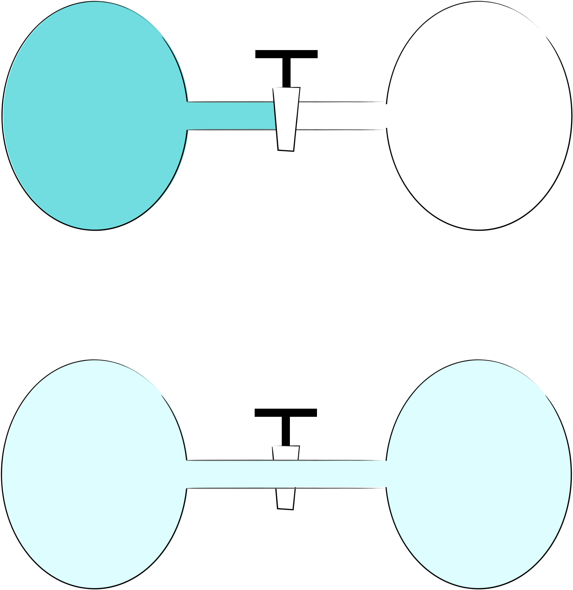
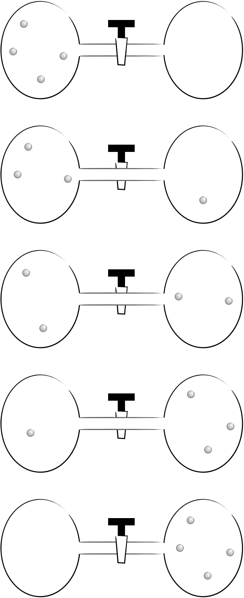
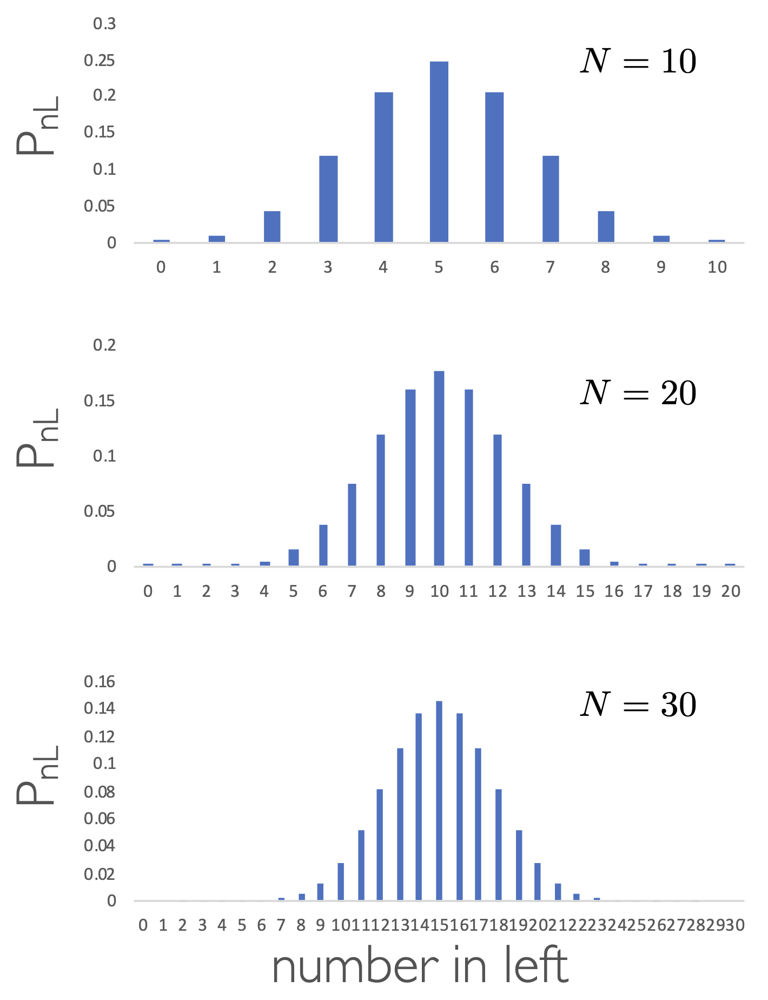
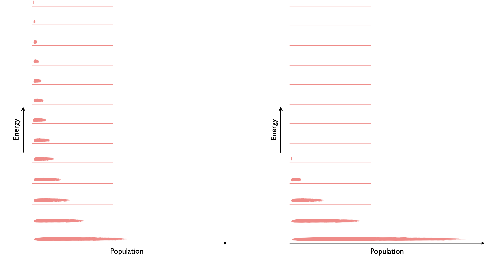

# Week 3  - Part 1 {#ch:Part5}

## One last thing before we introduce entropy

*The following video has been added for some context to the material, it is not core to the course and the material in it is not examinable.*

<div style="text-align: center;"><iframe width="560" height="315" src="https://www.youtube.com/embed/3VLOPILl7MU" frameborder="0" allow="accelerometer; autoplay; clipboard-write; encrypted-media; gyroscope; picture-in-picture" allowfullscreen></iframe><div style="text-align: left;">

<div style="text-align: left;">Thermodynamics was developed to understand steam engines better, to help improve their design.

It was found that no matter how well designed the boiler or pistons the efficiency of a steam engine was controlled by something engineers have no control over - them temperature of the surroundings.

\begin{equation}
\epsilon = 1-\frac{T_{\textrm{sink}}}{T_{\textrm{source}}}
(\#eq:efficiency)
\end{equation}

It was these experiments on efficiency by William Thompson (later Lord Kelvin) which lead to the concept of thermodynamic temperature we have already met in section \@ref(sec:zeroth). 

This equation for efficiency (equation \@ref(eq:efficiency)) says that a thermodynamic system (or steam engine) can only ever be 100% efficient if either the temperature of the 'sink' (or the surroundings as we have come to call them) is absolute zero, or else the temperature of the source (or system)  is infinite. Clearly neither of these cases can ever be true and so no system will ever be, can ever be, 100% efficient.

The reason you can never have 100% efficiency is entropy... but what is entropy?

## Thermodynamic spontaneity 

In thermodynamics when a process is spontaneous it will occur without work needing to be done to bring about any change.

This phrase can be turned around to say that work can be done to make a non-spontaneous process to occur.

```{r echo=FALSE, fridge, out.width='50%', fig.show='hold', fig.align='center', fig.cap='Fridges and freezers show that non-sponteneous processes can occur if work is done to make them happen - heat does not spontaneously from from cold bodies to hot bodies, but doing work (with the pump in the fridge) allows this thermodynamically non-spontenous process to occur.'}
knitr::include_graphics("images/fridge.png")
```

It is important to not confuse spontaneous processes with kinetics, a process may be spontaneous but occur very slowly. Spontaneity is just about the thermodynamics.

If a balloon contains a mixture of hydrogen gas and oxygen gas it will happily just float there not reacting at room temperature - it is only when a spark is added to the system that the gases react to form water. Without a spark the kinetics are very, very slow, but the reaction is still spontaneous. 

*There will be more about this process later in the course, as some people confuse the reaction of gases to form a liquid as being non-spontaneous.*

## Second Law of Thermodyanamics

<div style="text-align: center;"><iframe width="560" height="315" src="https://www.youtube.com/embed/a8kBCMdawxw" frameborder="0" allow="accelerometer; autoplay; clipboard-write; encrypted-media; gyroscope; picture-in-picture" allowfullscreen></iframe><div style="text-align: left;">

<div style="text-align: left;">Just like the first law there are various statements of the first law of thermodynamics, because various people were working on the same problem at the same time.

The most famous of these statements is:

<div style="text-align: center;"><span style="color: deeppink;">‘the entropy of an isolated system tends to increase’

<div style="text-align: left;"><span style="color: black;">

and another common statement which considers systems which are not isolated:

<div style="text-align: center;"><span style="color: deeppink;">‘the entropy of a universe increases during any spontaneous change’

<div style="text-align: left;"><span style="color: black;">

Clausius linked the change in entropy of a system to the 'heat' added to that system reversibly, where temperature  is again a factor:

\begin{equation}
\Delta S=\frac{q_{\textrm{rev}}}{T}
(\#eq:clausius)
\end{equation}

This equation says that the entropy increase for a given amount of heat is greater at lower temperatures. This is the minimum amount of entropy change (if the process isn't reversible then the entropy change is higher).

This is often stated as the clausius inequality (where the heat isn't considered to be exchanged reversibly):

\begin{equation}
\Delta S \geq \frac {q}{T}
(\#eq:clausiusineq)
\end{equation}

One thing entropy is **not** is dis*****! This is not an acceptable understanding of entropy - please try and forget the 'd-word' when thinking about entropy.

## The statistical nature of entropy

<div style="text-align: center;"><iframe width="560" height="315" src="https://www.youtube.com/embed/JMhS2sKxAx4" frameborder="0" allow="accelerometer; autoplay; clipboard-write; encrypted-media; gyroscope; picture-in-picture" allowfullscreen></iframe><div style="text-align: left;">

If we look at two bulbs, one containing gas and the other vacuumm and open the tap between the two containers we are not surprised when the gas distributes between the two bulbs.

```{r echo=FALSE, gasdistribution, out.width='50%', fig.show='hold', fig.align='center', fig.cap='If we have two bulbs, one with gas the other with vacuum and open the tap it is unsurprising that the gas distributes evenly between the two bulbs.'}

```

### Macrostates

So what is happening on a molecular level? Simplifying the system to just 4 particles in the two bulbs, there are 5 possible ways of arranging this system (figure \@ref(fig:macro)).

```{r echo=FALSE, macro, out.width='50%', fig.show='hold', fig.align='center', fig.cap='There are five possible ways of aranging four particles between two bulbs.'}

```

Each of these possible arrangements are called the macrostates of the system, however the probability of achieving each of these macrostates is not the same.

### Microstates

The probability of any one of these states occuring depends upon the number of microstates making up each macrostate. If we consider this system and imagine we can individually name each atom:

- all ‘atoms’ in the LH container there is only one possible arrangement
- all ‘atoms’ in the RH container there is only one possible arrangement
- 3 ‘atoms’ in the LH container and 1 in the RH there are four possible arrangements
- 3 ‘atoms’ in the RH container and 1 in the LH there are four possible arrangements
- 2 ‘atoms’ in the LH container and 2 in the RH container there are six possible arrangements

The total number of permutations is 2^4^ = 16.

The total number of permutations of any system is given by:

\begin{equation}
\textrm{permutation}=\textrm{possible outcomes}^\textrm{number of particles}
(\#eq:permutations)
\end{equation}

and the multiplicity of microstates is given by:

\begin{equation}
\Omega = \frac{N!}{n_A!n_B!}
(\#eq:multiplicity)
\end{equation}

The probability of any given state occuring is the number of microstates making up a macrostate divided by the total number of permutations of the system.


```{r echo=FALSE, probabilityleft, out.width='50%', fig.show='hold', fig.align='center', fig.cap='The probability of the number of particles in the left hand container for systems containing 10 (top), 20 (middle) and 30 (bottom) particles.'}

```

### Statistical entropy

Logic says that entropy is an extensive property, if we have twice as much stuff we have twice the entropy. However system permutations are not additive.

Boltzman related the permutations of a system to the absolute entropy of the system (equation \@ref(eq:boltzmann).

\begin{equation}
S=\textrm{k}_B \ln \Omega
(\#eq:boltzmann)
\end{equation}

Boltzmann was actually concerned with the distribution of energy in a system. If you recall the total internal energy (our macrostate) is the sum of the particles each having different energies (our microstates), we said that the probability of existing in a given energy level (or microstate) fell exponentially.

Therefore as the temperature falls the probability of being in any given microstate increases and the entropy of the system decreases.


```{r echo=FALSE, tempentropy, out.width='50%', fig.show='hold', fig.align='center', fig.cap='As the temperature of the system falls the probability of being in a particular level increases and so the temperature falls.'}

```

## Questions {#sec:w3p1question}

1. What is the change in entropy of a system is 50.0 kJ of energy is reversibly added in the form of heat to 100 g of water at exactly 10 ºC?

1. Consider a system with two bulbs and 20 particles. What is the probability that all 20 atoms will be found in a single bulb?

1. When 1 mol of trichloromethane is heated from 5°C to 20°C at constant pressure, the
change of entropy is + 6.00 J K^−1^ mol^−1^ . When the solvent is heated further from 20 °C to 35°C, the change in entropy will also be + 6.00 J K^−1^ mol^−1^ your reasoning. You may assume C~p~ is constant over this range.


## Answers {#sec:w3p1ans}

1. ΔS = +177 J K^−1^

1. $\frac{2}{2^{20}}$

1. No. Entropy changes for the same input of heat are greater at lower tempeartures.
