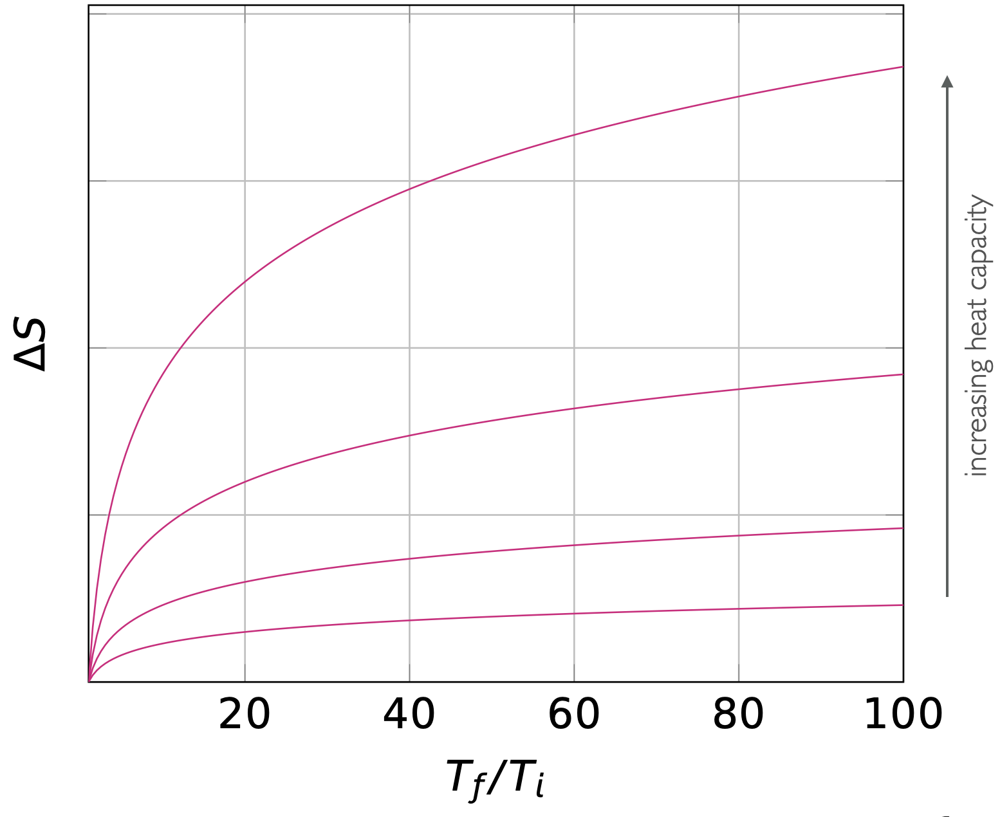
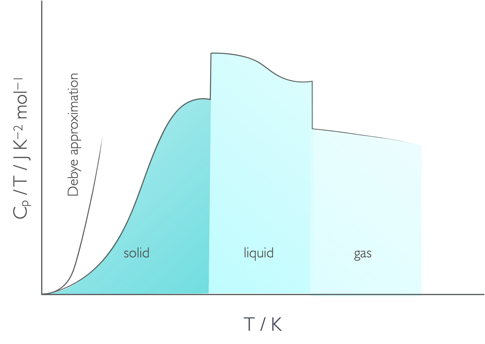
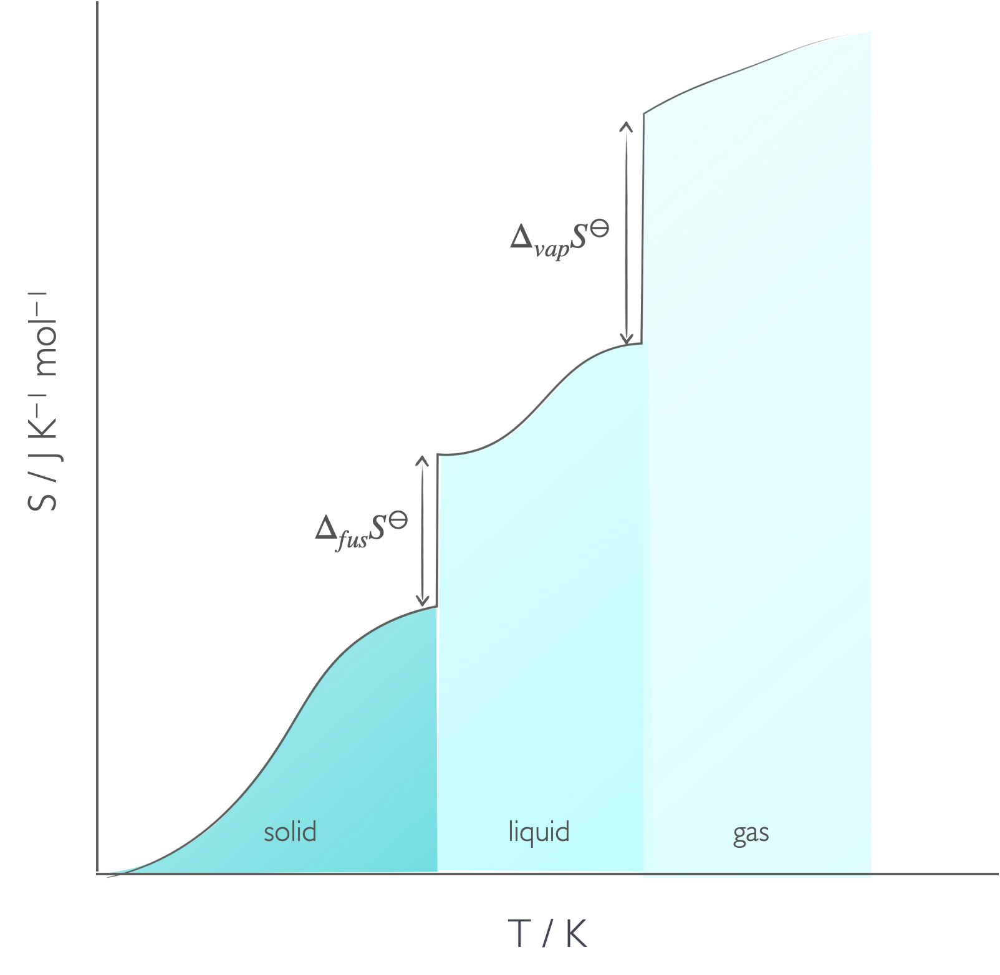
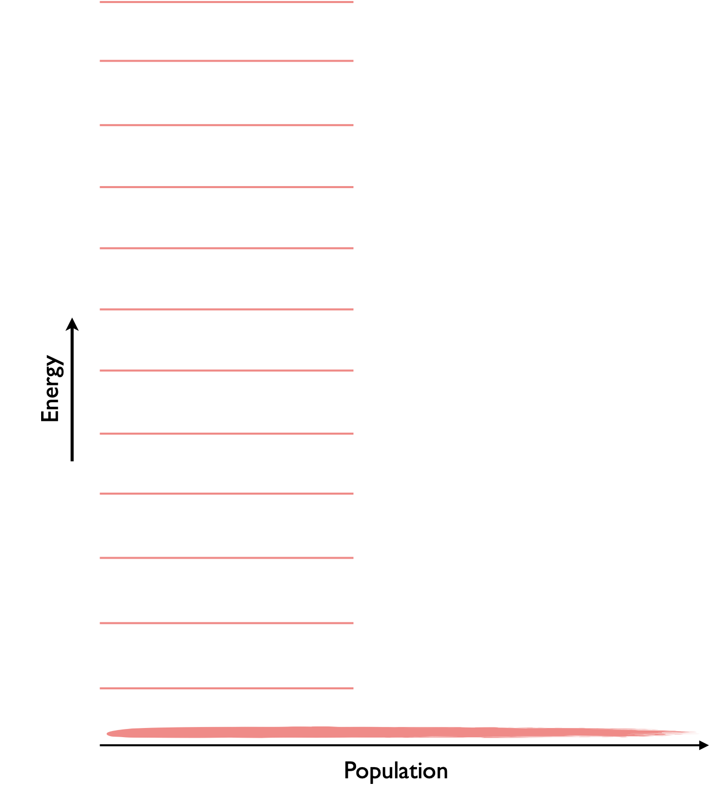
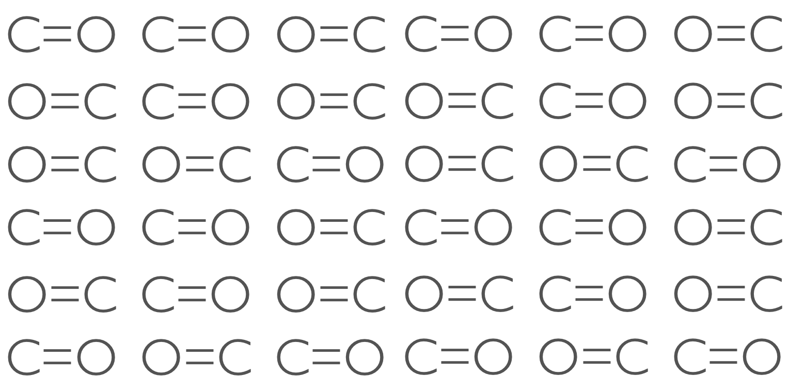
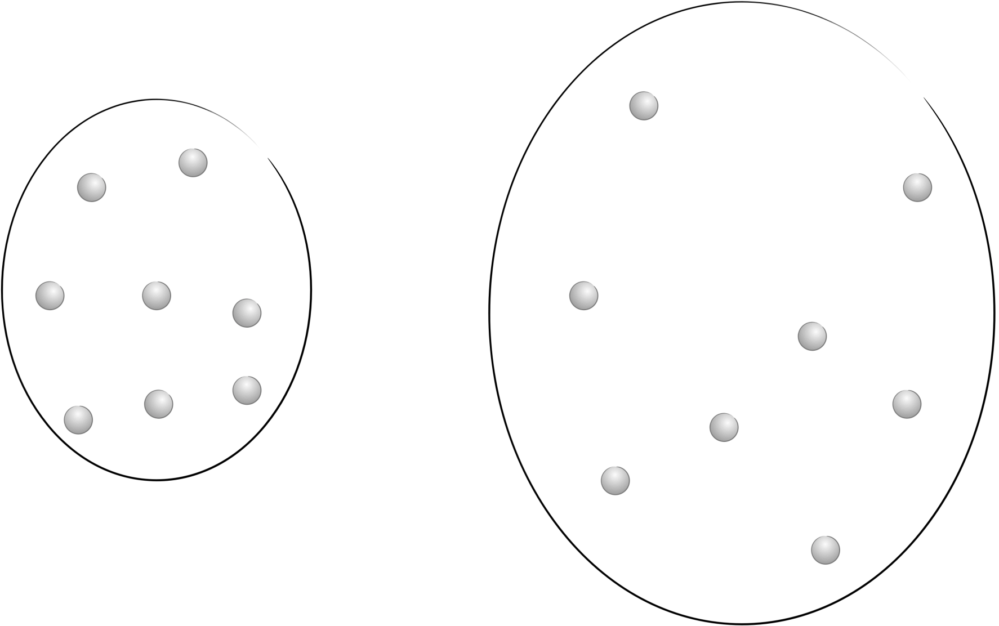

# Week 3  - Part 2 {#ch:Part6}

## How temperature affects entropy

The absolute entropy of a substance is the area underneath the plot of $\frac{C_p}{T}$ against $T$ between absolute zero and the temperature of interest. As shown in figure \@ref(fig:entropytemp) the entropy difference going between the two temperatures is teh area underneath the curve between the initial and final temperatures. 

```{r echo=FALSE, entropytemp, out.width='80%', fig.show='hold', fig.align='center', fig.cap='The entropy change of a substance is the area of the left hand plot between teh initial and final temperature.'}
knitr::include_graphics("images/entropytemp.png")
```

From equation \@ref(eq:clausius) the entropy change of heating or cooling a substance is given by:

\begin{equation}
\Delta S=C_x \ln \frac{T_f}{T_i}
(\#eq:entropytemp)
\end{equation}

and the bigger the value of heat capacity ($C_x$) the bigger the change in entropy for the same change in temperature.

```{r echo=FALSE, entropyheatcapacity, out.width='80%', fig.show='hold', fig.align='center', fig.cap='The entropy change going between two temperatures is larger for substances with larger heat capacities.'}

```

For any chemical process we can now work out the enthalpy change for the reaction at a new temperature, assuming the heat capacity is constant over the temperature range considered.

\begin{equation}
\Delta S_{T_f} = \Delta S_{T_i} + C_x \ln \frac{T_f}{T_i}
(\#eq:entropyrxntemp)
\end{equation}

<div style="text-align: center;"><iframe width="560" height="315" src="https://www.youtube.com/embed/oV6b3iGfwIU" frameborder="0" allow="accelerometer; autoplay; clipboard-write; encrypted-media; gyroscope; picture-in-picture" allowfullscreen></iframe><div style="text-align: left;">

<div style="text-align: left;">
## The entropy of phase changes

If we look at how the heat capacity divided by temperature changes as a function of temperature we see clear breaks in function where the phase changes are (figure \@ref(fig:Cpphase)).

```{r echo=FALSE, Cpphase, out.width='80%', fig.show='hold', fig.align='center', fig.cap='The phase changes are obvious on a plot of Cp/T against T showing the latent heat of the phase change clearly. Recall that the absolute entropy of a substanced is the area under this plot.'}

```

The absolute molar entropy of a substance is sum of the entropy for heating and the entropy of the phase change.


```{r echo=FALSE, entropyphase, out.width='80%', fig.show='hold', fig.align='center', fig.cap='The absolute entropy of a material has to consider the entropy of heating between absolute zero and the melting temperature, the entropy of fusion, the entropy between the melting temperature and boiling temperature, the entropy of vapourisation and then the entropy between the boiling temperature and final temperature.'}

```

\begin{equation}
S_m(T) = S_m(0)+ \int_0^{T_f}\frac{C_p(s)}{T}\textrm{d}T+ \frac{\Delta _{fus} H}{T_f}+ \int_{T_f}^{T_b}\frac{C_p(l)}{T}\textrm{d}T+ \frac{\Delta _{vap} H}{T_f}+ \int_{T_f}^T\frac{C_p(g)}{T}\textrm{d}T
(\#eq:entropyphase)
\end{equation}

<div style="text-align: center;"><iframe width="560" height="315" src="https://www.youtube.com/embed/6M27Y8A3e7o" frameborder="0" allow="accelerometer; autoplay; clipboard-write; encrypted-media; gyroscope; picture-in-picture" allowfullscreen></iframe><div style="text-align: left;">

<div style="text-align: left;">

From equation \@ref(eq:clausius) we can relate the enthalpy of phase change and entropy of phase change at constant pressure because phase changes are reversible processes.

\begin{equation}
\Delta_{vap} S=\frac{\Delta_{vap} H }{T_b}
(\#eq:entropyvap)
\end{equation}

\begin{equation}
\Delta_{fus} S=\frac{\Delta_{fus} H }{T_m}
(\#eq:entropyfus)
\end{equation}

### Trouton's Rule

Trouton's rule is an empirical relationship which found that $\frac{\Delta_{vap} H }{T_b}$ is around 85 J K^−1^ mol^−1^ for liquids that have no hydrogen bonding. For substances with hydrogen bonding $\Delta_{vap} H$ is considerably higher because more heat is required to break all of the intermolecular bonds.

Equally some species have a lower than predicted entropy of vapourisation. These species may still have intermolecular bonding in the gas phase, such as formic acid which forms a molecular dimer at temperatures just above the boiling temperature (you can then see a 'phase change' as this dimer dissociates at even higher temperatures). Otherwise it may be that the species is particularly 'small' and has a low moment of rotational inertia, leading to large spacings in molecular energy levels and therefore relatively low entropy in the population of these levels.


Table: (\#tab:trouton)  Thermodynamic data for the vaporisation of a range of chemical species.

||$\Delta_{vap} S^\ominus$ / J K^−1^ mol^−1^|$\Delta_{vap} H^\ominus$ / kJ mol^−1^| $T_b$ / K|
|:----:|:----:|:----:|:----:|
| benzene | 87.2 |30.8|353.2|
| bromine |88.6|29.45|332.4|
| tetrachloromethane |85.9|30.00|349.9|
| hydrogen sulphide |87.9|18.67|212.8|
| mercury |94.2|59.30|692.7|
| ammonia |97.4|23.4|239.7|
| water |109.1|40.7|373.2|
| methane |73.2|8.18|111.7|
| argon |74.4|6.5|87.3|
| formic acid | 61.8 | 23.1 | 373.9 |


## Residual entropy

As we cool our sample you would expect that as the temperature reaches absolute zero you would expect the entropy to fall to zero, however under some circumstances there may still be multiple possible ways of arranging a system. These include:

- isotopes being randomly distributed in a sample
- systems where there is no enthalpy change for different arrangements, such as CO
- degeneracy in ground state

```{r echo=FALSE, entropyzero, out.width='80%', fig.show='hold', fig.align='center', fig.cap='If we follow our molecular understanding of entropy from Boltzmann we could theoretically reach a point with zero entropy where all molcules are in the same state.'}

```

```{r echo=FALSE, CO, out.width='80%', fig.show='hold', fig.align='center', fig.cap='CO molecules can exist in one of two states (C=O and O=C) and because ther eis a very even electic charge across the molecule the two states are degenerate in energy and two possible microstates exist for each CO site in the crystal.'}

```

We can calculate the residual entropy using the statistical definition of entropy (equation \@ref(eq:boltzmann)).

<div style="text-align: center;"><iframe width="560" height="315" src="https://www.youtube.com/embed/2h52VrudtWw" frameborder="0" allow="accelerometer; autoplay; clipboard-write; encrypted-media; gyroscope; picture-in-picture" allowfullscreen></iframe><div style="text-align: left;">

<div style="text-align: left;">
## Entropy changes for isothermal expansion of a gas

<div style="text-align: center;"><iframe width="560" height="315" src="https://www.youtube.com/embed/WKGH-rZF6WA" frameborder="0" allow="accelerometer; autoplay; clipboard-write; encrypted-media; gyroscope; picture-in-picture" allowfullscreen></iframe><div style="text-align: left;">

<div style="text-align: left;">

If we think about entropy of the probabiity of a given state being achieved then as the 'box' gets bigger the probability of a particle being in any position falls and so the entropy of the system increases.

```{r echo=FALSE, entropyexpansion, out.width='80%', fig.show='hold', fig.align='center', fig.cap='As the container expands the molecules have more possible positions and so the probability of a particle being in any single postion is reduced and the entropy increases.'}

```

If we actually think about the energy levels in the system, we know that the occupation of these levels follows the Maxwell-Boltzmann distribution (equation \@ref(eq:maxwell)) when the levels are spaced further apart, fewer macrostates are occupied and so the probability of finding a particle in any state is relatively high. As the energy levels get closer together the probability of finding a particle in any given level decreases and so the entropy of the system increases.


```{r echo=FALSE, boxlevels, out.width='80%', fig.show='hold', fig.align='center', fig.cap='According to the particle in a box model energy levels in a small box (left) are spaced further apart than those in a larger box.'}

```

Now if we consider the entropy change in an isothermal expansion then:

\begin{equation}
\Delta S=nR \ln\frac{V_\textrm{f}}{V_\textrm{i}}
(\#eq:entropyexpansion)
\end{equation}

This equation is derived from our expression of work done in a reversible expansion, and the relationship between heat and work when that expansion is isothermal. Combining this with our definition of entropy (\@ref(eq:clausiusineq)) gives us this expression above.

## Questions {#sec:w3p2question}


1. Calculate the change of entropy change when exactly 1 mol of methanol is heated at constant pressure from 5 °C to 35 °C, the molar heat capacity, C~p~, of methanol is 81.6 J K^−1^ mol^−1^, assume that the molar heat capacity, C~p~ is constant over this temperature range.

2. Calculate the entropy change of cooling of liquid mercury from 25 ºC to 0 ºC. (C~p~ = 27.98 J K^−1^ mol^−1^)

3. Calculate the change in entropy of 5.151 mol of a perfect gas when it is compressed isothermally to 59.8 % of its initial volume.

4. Use the following data to calculate the reaction entropy at 298 K for the thermal decomposition of 2.651 g of ammonium chloride, NH4Cl

NH~4~Cl(s) → NH~3~(g) + HCl(g)


| | Sm° / J K^−1^ mol^−1^ |
| NH~4~Cl(s) | 94.85 |
| NH3(g) | 192.77 |
| HCl(g) | 186.90 |

5.  If the specific heat of water is 4.184 J K^−1^ g^−1^ what is the change in entropy when water is heated from 20 ºC and 80 ºC?

## Answers {#sec:w3p2ans}

1. $\Delta S=$ 8.36 J K^−1^ mol^−1^

2. $\Delta S=$ −2.45 J K^−1^ mol^−1^

3. $\Delta S=$ -22.02 J K^−1^ mol^−1^

4. $\Delta S=$ +14.11 J K^−1^

5. $\Delta S=$ 14.0 J K^−1^ mol^−1^
