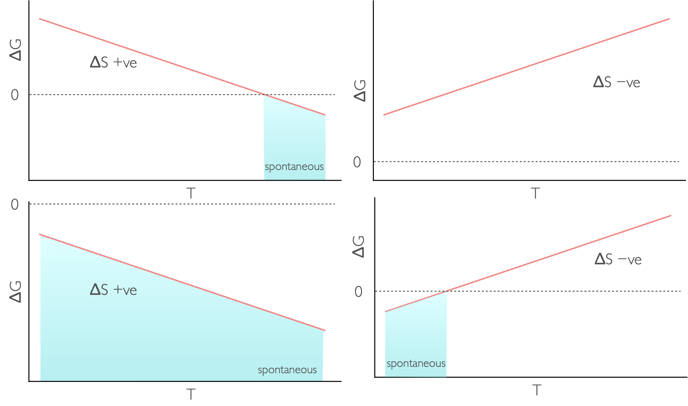
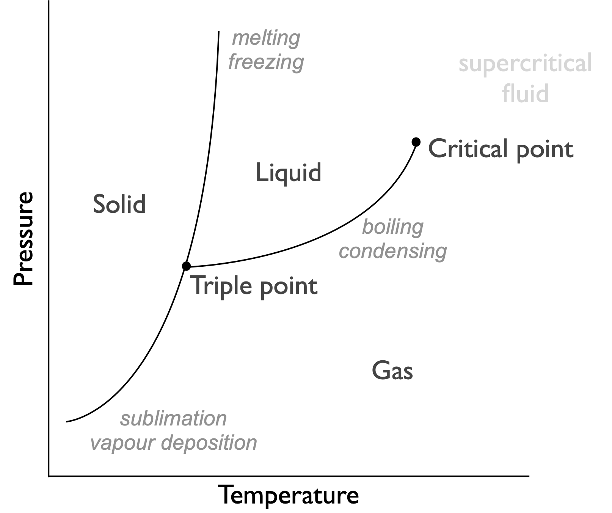
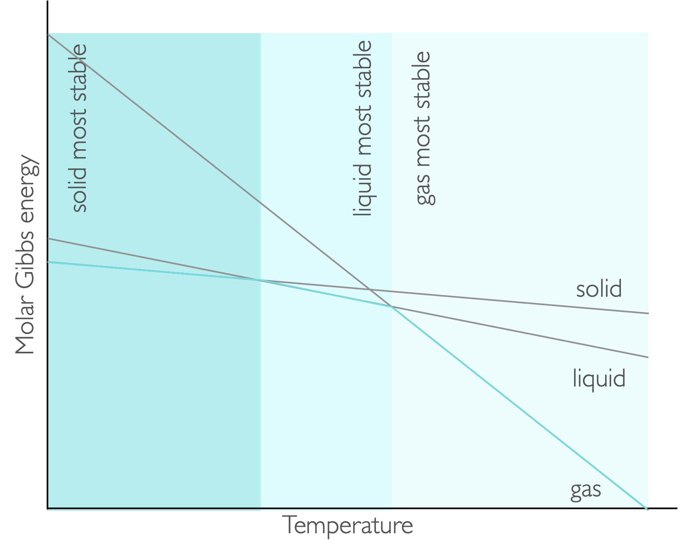
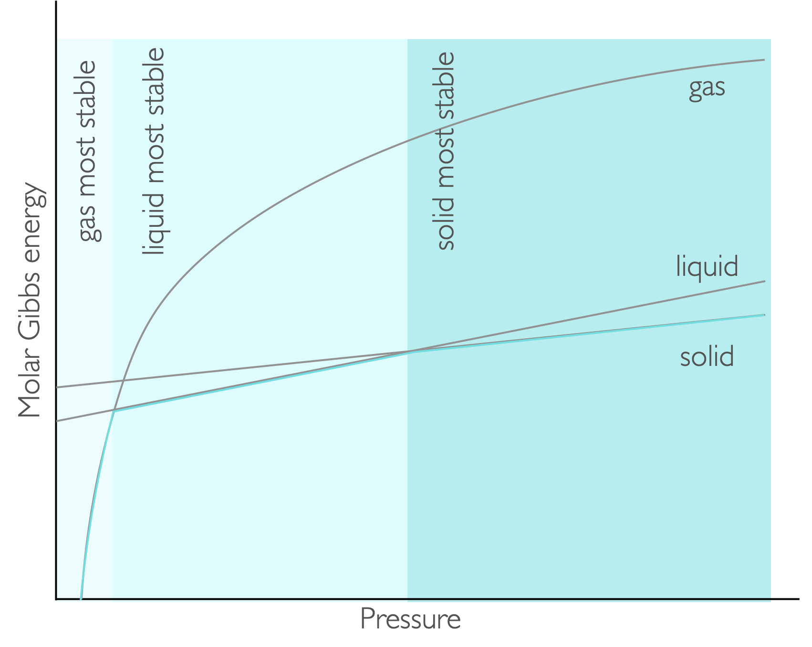
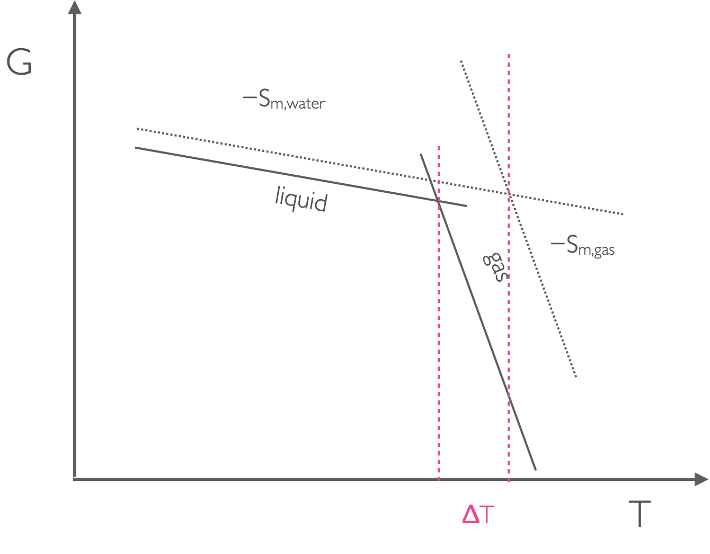

# Week 4  - Part 1 {#ch:Part7}

## Gibbs' free energy

You will recall from section \@ref(sec:2ndlaw) that the entropy of a universe has to increase in any spontaneous change. Equation \@ref(eq:clausius), linked the entropy, $\Delta S$, to the heat provided to the system reversibly, $q_{\textrm{rev}}. Consequently, since the heat lost from the surroundings and the heat gained by the system are the same, at constant pressure we can say:

\begin{equation}
\Delta S_{sur}=-\frac {\Delta H}{T}
(\#eq:entropysurrounding)
\end{equation}

J.W. Gibbs' contribution to thermodynamics was recognising that the entropy change of the universe was the sum of the entropy of the system and surroundings, and by using the relationship in equation \@ref(eq:entropysurrounding) the total entropy of the universe can be definied solely in terms of the thermodynamics of the system. Gibbs went on further to define the Gibbs' free energy, $\Delta G$ as $\Delta G = - T\Delta S_{\textrm{total}}$.

This gives one of the most important equations in science, the Gibbs' equation:

\begin{equation}
\Delta G^\ominus = \Delta H^\ominus - T \Delta S^\ominus
(\#eq:Gibbs)
\end{equation}

Since enthalpy, entropy and temperature are all state functions so is the Gibbs' free energy, which we have already seen in section \@ref(sec:equations1), equation \@ref(eq:Gibbsstate). 

The free energy of a system is a measure of a system's ability to do (non-expansion) work.

:::video
<iframe width="560" height="315" src="https://www.youtube.com/embed/mVxF8mAiuXM" frameborder="0" allow="accelerometer; autoplay; clipboard-write; encrypted-media; gyroscope; picture-in-picture" allowfullscreen></iframe>
:::

### Helmholtz free energy

There is an equivalent function called the Helmholtz free energy ($A$ and $\Delta A$ for changes), which is a measure of the free energy at constant volume, whilst I am mentioning it here in chemistry it is more usual to consider the Gibbs' free energy.

\begin{equation}
\Delta G = \Delta H - T \Delta S
(\#eq:Helmholtz)
\end{equation}

### Factors affecting the Gibbs free energy

The Gibbs' equation makes it fairly clear that the Gibbs' energy depends upon temperature.

Table: (\#tab:Gibbstemp)  The spontaneity of a reaction at different temperatures.

|$\Delta H$ | $\Delta S$ | $\Delta G$ | Spontaneity |
|:----:|:----:|:----:|:----:|
| + <br> endothermic | + | + at low T <br> − at high T | spontaneous at high temperature |
| + <br> endothermic | − | + | needs work to occur |
| − <br> exothermic | + | − | always spontaneous |
| − <br> exothermic | − | − at low T <br> + at high T | spontaneous at low temperature |


```{r echo=FALSE, Gibbstemp, out.width='80%', fig.show='hold', fig.align='center', fig.cap='The temperature dependence of Gibbs free energy for different reaction types: endothermic and increase in entropy (top left), endothermic with a decrease in entropy (top right), exothermic with an increase in entropy (bottom left) and exothermix with a decrease in entropy (bottom right).'}

```

We can derive an expression which shows that the Gibbs' free energy depends only upon the pressure and temperature of a system:

\begin{equation*}
\textrm{d}G= -S\textrm{d}T + V\textrm{d}p
\end{equation*}

This result is already known to you as it is the basis of phase diagrams (section \@ref(sec:phasegibbs)).

:::video
<iframe width="560" height="315" src="https://www.youtube.com/embed/qzL0htItknQ" frameborder="0" allow="accelerometer; autoplay; clipboard-write; encrypted-media; gyroscope; picture-in-picture" allowfullscreen></iframe>
:::

### Dilution

The entropy change of dilution is given by:

\begin{equation*}
\Delta S = R \ln \frac{c_i}{c_f}
\end{equation*}

This makes sense as it is similar to equation \@ref(eq:entropyexpansion), for the entropy change of expansion, but high concentrations occur at low volumes and so the terms are switched.

Consequently if the enthalpy of dilution is 0, (which is normally though not always the case), this means the Gibbs energy change of dilution is:

\begin{equation}
\Delta G = RT \ln \frac{c_f}{c_i}
(\#eq:Gibbsdilution)
\end{equation}

:::video
<iframe width="560" height="315" src="https://www.youtube.com/embed/LD3vB-DZAr4" frameborder="0" allow="accelerometer; autoplay; clipboard-write; encrypted-media; gyroscope; picture-in-picture" allowfullscreen></iframe>
:::

## Phase changes {#sec:phasegibbs}

```{r echo=FALSE, phasediagram, out.width='80%', fig.show='hold', fig.align='center', fig.cap='Phase diagram for a typical system, indicating phases are functions of pressure and temperature. This is because the favoured phase is definied by the Gibbs free energy of the system'}

```

A phase diagram is actually a figure showing which phase has the lowest Gibbs' free energy, at phase boundaries the values of Gibbs' free energy for the two phases are identical and they are in equilibrium. The phase diagrams show that there is both a pressure and temperature dependance of the Gibbs' free energy.


```{r echo=FALSE, gibbstempstate, out.width='80%', fig.show='hold', fig.align='center', fig.cap='The gradient of each line on a plot of Gibbs free energy against temperature is −S, consequently at low temperatures teh solid has the lowest value of molar Gibbs energy at low temperature and that phase is favoured, as the temperature is increased teh liquid and then the gas are favoured'}

```


```{r echo=FALSE, gibbspressurestate, out.width='80%', fig.show='hold', fig.align='center', fig.cap='For pressure the molar Gibbs energy varies as a function of pressure with the gradient being the molar volume. At low pressures the gas is the most stable, with liquid and solid being favoured as the pressure increases.'}

```

### Clausius-Clapeyron equation

The Clausius-Clapeyron equation shows how the pressure and temperature are linked at the liquid gas phase boundary.

\begin{equation}
\ln \frac{p_2}{p_1}=-\frac{\Delta _{vap}H}{R}\left( \frac{1}{T_2}-\frac{1}{T_1}\right)
(\#eq:clausiusclapeyron)
\end{equation}

Here we can predict the temperature of boiling as the pressure changes if we know these values for the phase change at another temperature and pressure.

We know that the driving force of a reaction depends upon pressure, $\Delta G _m = V_m \Delta p$, this means that we can determine the relative position of lines of a GT plot based upon the pressure and molar volumes of the two phases.

```{r echo=FALSE, boilingpressure, out.width='80%', fig.show='hold', fig.align='center', fig.cap='As the pressure changes the position of the lines on a GT plot move up or down depending on the molar volume, this means that at higher pressure the point where the lines from liquid and gas moves and the temperature of the phase change is different.'}

```

### Clapeyron equation

The Clapeyron equation shows how the pressure and temperature are linked at the solid liquid phase boundary:

\begin{equation}
\Delta p=\frac{\Delta_{fus} H}{T \Delta _{fus}V}\Delta T
(\#eq:clapeyron)
\end{equation}

Here the pressure and temperature are linked by the melting temperature, $T$, enthalpy of fusion, $\Delta _{fus}H$, and change in molar volume of the phase change $\Delta _{fus} V$.

A similar plot to figure \@ref(fig:boilingpressure) can be used to justify the difference in temperature of fusion with changing pressure.

It should be noted that the temperature difference of fusion at different pressures are much smaller than for equivalent temperatures and pressures for vaporisation.

:::video
<iframe width="560" height="315" src="https://www.youtube.com/embed/M03uqpvMszc" frameborder="0" allow="accelerometer; autoplay; clipboard-write; encrypted-media; gyroscope; picture-in-picture" allowfullscreen></iframe>
:::

## Questions {#sec:w4p1question}

1. Calcium carbonate, CaCO~3~, decomposes to form CaO and CO~2~ with ΔH = 178 kJ mol^-1^ and ΔS  = 161 J K^-1^ mol^-1^.  Estimate the temperature at which the decomposition becomes spontaneous.

1. Calculate the melting temperature of benzene at exactly 100 bar. ($\Delta _{fus} H$ = + 10.59 kJ mol^-1^, $T_m$ = 278.7 K, $V_m$ (l)= 88.86 cm^3^ mol^−1^, $V_m$ (s)= 87.67 cm^3^ mol^−1^).

1. The standard Gibbs energy for a reaction is -332.9 kJ mol^−1^ at 298 K and -339.5 kJ mol^−1^ at 500 K. Estimate the standard ethalpy and entropy change for the reaction. You may assume that H and S do not vary in this temperature range. 

1. The saturated vapour pressure of a compound is 2.339 kPa at 20 °C and 19.948 kPa at  60 °C. Calculate the enthalpy change of vaporization.

## Answers {#sec:w4p1answer}

1. T = 1.11 kK

1. T~fus~ (100 bar) = 279.0 K

1. $\Delta S$ = 33 J K^-1^ mol^-1^, $\Delta H$ = −323.2 kJ mol^-1^

1. $\Delta_{vap} H$ = 43.5 kJ mol^-1^
