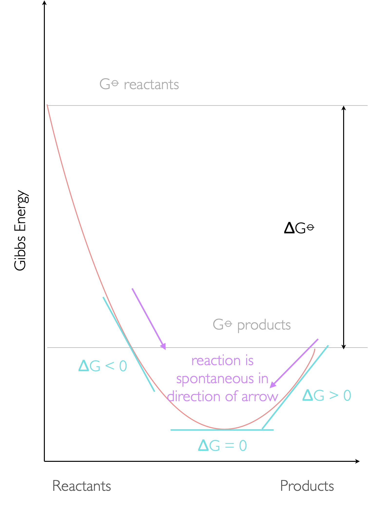
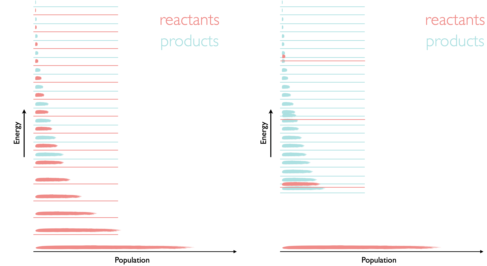
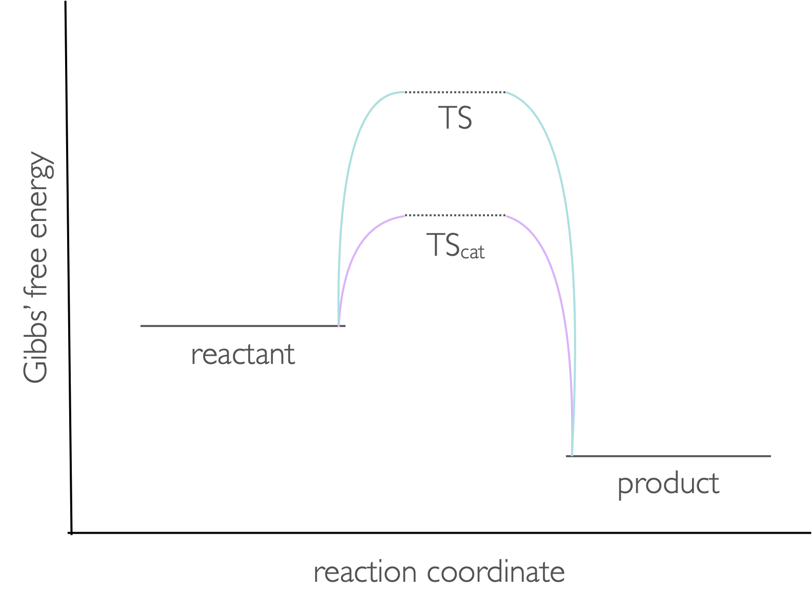
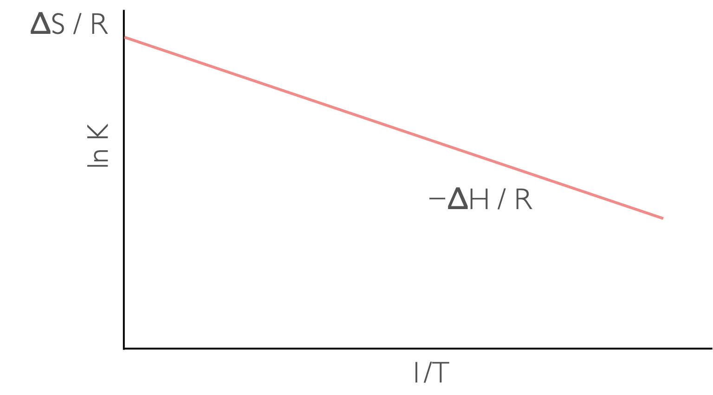
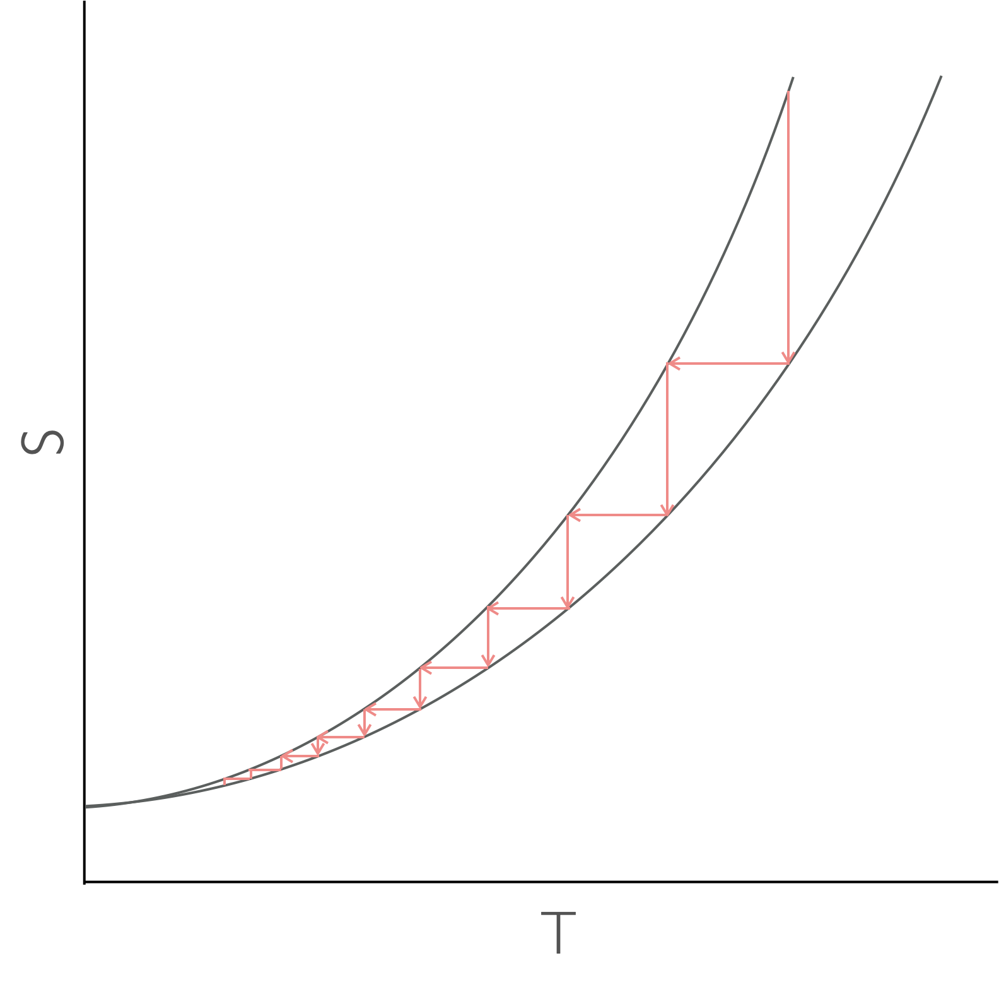

# Week 4  - Part 2 {#ch:Part8}

## How ΔG relates to the equilibrium constant, K

The driving force of a reaction, ΔG~⦵~ , is linked to the equilibrium constant for that process by equation \@ref(eq:Gibbsequilibrium).

\begin{equation}
\Delta G^\ominus = -RT \ln K
(\#eq:Gibbsequilibrium)
\end{equation}

Consequently, the bigger the driving force of a reaction ( the more negative ΔG^⦵^) the more the equilibrium lies towards the products of a reaction. Here we introduce a second version of the Gibbs' free energy (ΔG), this is for when we are looking at the driving force of the reaction but for at any point in the reaction where we no longer have pure reactants and pure products.


```{r echo=FALSE, gibbsequilibrium, out.width='50%', fig.show='hold', fig.align='center', fig.cap='The reaction profile showing the Gibbs free energy (ΔG⦵) between pure reactants and products but also the driving force (ΔG). at any point of the reaction, the equilibrium is reached when ΔG=0 and both forward and backward reactions will occur until the compositon of the system matches the position of the thermodynamic equilibrium.'}

```

If we look at this on a molecular level, we know that the population of energy levels depends upon temperature, and we have previously seen in equation \@ref(eq:Gibbs) that the Gibbs free energy also depends upon the enthalpy and entropy of the system. Enthalpy gives us the relative positions of the bottom or the ladder (or well) for reactants and products and entropy is related to the closeness of energy levels and the number of available microstates.


```{r echo=FALSE, energyleveleq, out.width='100%', fig.show='hold', fig.align='center', fig.cap='The two systems are both endothermic (ΔH⦵ is +ve) but for the case of the system on the left the entropy is similar for both reactants and products and therefore the equilibrium position (following a Boltzmann distribution across all available energy levels) favours the reactants. For the system on the right due to the closely packed energy levels more microstates are available for the products and so it has a higher entropy, conseqnently the product in this case is much more favoured.'}

```

:::video
<iframe width="560" height="315" src="https://www.youtube.com/embed/MX3r2o-4n4k" frameborder="0" allow="accelerometer; autoplay; clipboard-write; encrypted-media; gyroscope; picture-in-picture" allowfullscreen></iframe>
:::

### The equilibrium constant, K

The equilbrium constant for a reaction is defined as the *activity* of the products raised to their stoichiometric quantity divided by the *activity* of the reactants raised to their stoichiometric quantity (equation \@ref(eq:equilibrium)).

\begin{equation}
K = \frac{a_C^ca_D^d}{a_A^aa_B^b}
(\#eq:equilibrium)
\end{equation}

Activity is sometimes called the *effective concentration* and so it makes sense that the thermodynamics depends upon activity and not concentration or pressure although equivalent expressions for concentration and pressure may be determined with equilibrium constants $K_c$ and $K_p$ respectively. However we cannot take the log of any value with units and so these versions of equilibrim constant are largely useless in thermodynamics.

For most gaseous systems at atmospheric pressure or lower ideality is a reasonable assumption, as is ideality of low concentration solutions of none charged species, however any ionic solution quickly deviates from ideality at very low concentration and so the activity coefficient needs to be calculated.

The activity of an dissolved species may be determined from:

\begin{equation*}
a_x = \gamma \frac{[X]}{[X]_0}= \gamma \frac{[X]}{1 \textrm{ mol dm}^{-3}}
\end{equation*}

and the activity of a gaseous species from the equivalent expression:

\begin{equation*}
a_x =\gamma \frac{p_x}{P_{x0}}= \gamma\frac{p_x}{1 \textrm{ bar}}
\end{equation*}

:::video
<iframe width="560" height="315" src="https://www.youtube.com/embed/y2NUJwQdeJE" frameborder="0" allow="accelerometer; autoplay; clipboard-write; encrypted-media; gyroscope; picture-in-picture" allowfullscreen></iframe>
:::

### le Châtelier's principle

The whole point of an equilibrium is that the composiont of the system is defined by the equilbrium constant K, the only thing which affects K is the thermodyanamic temperature.

le Châtelier's principle states *‘if a change is made to a system in dynamic equilibrium the system will respond so as to oppose the change'*, so if we add more product to ensure the equilibrium is restored some product will undergo the back reaction to produce reactants such that the value of K is unchanged.

Another example could be for a gaseous reaction where if we increase the pressure of the system at equilibrium we disturb the equilibrium and the sytem will react to reduce (if possible) the total number of moles (or move to the side of the reaction with the lowest molar volume).

### Effect of catalysts

Catalysts affect rate, not thermodyanamics, the presence of a catalyst will affect the rate of both forward and back reactions but the position of the equilibrium will be unchanged. (Reactions are always occuring, but at equilibrium the rate of the forward reaction and rate of back reaction are the same).

Catalysts affect the rate by affecting the height of the activation barrier, this is in effect lowering the Gibbs' free energy of the transition state (figure \@ref(fig:catalyst)).

```{r echo=FALSE, catalyst, out.width='100%', fig.show='hold', fig.align='center', fig.cap='The transition state during a reaction has a higher Gibbs free energy than either the reactants or products. The presence of a catalyst lowers the energy of this transition state.'}

```

## Reaction quotient {#sec:quotient}

We can define the reaction quotient, Q,  at any point during a reaction:

\begin{equation}
Q = \frac{a_C^ca_D^d}{a_A^aa_B^b}
(\#eq:quotient)
\end{equation}

The expression for reaction quotient is the same used as for equilibrium constant but is true for any values of activity of reactants and products. This means that we can determine the driving force (or remaining work we can derive from a reaction) at any point in the reaction, not just for pure reactants and products.

\begin{equation}
\Delta _r G = \Delta _r G ^ \ominus + RT \ln Q
(\#eq:gibbsquotient)
\end{equation}

## How temperature affects K {#sec:tempK}

We have already seen that both the enthalpy and entropy (and therefore Gibbs' free energy) depend upon temperature, and we have also seen that the equilibrium composition (and therefore equilibrium constant) also depends upon tempearture.

Henry van't Hoff combined two expressions for Gibbs' free energy (equations \@ref(eq:Gibbsequilibrium) and \@ref(eq:Gibbs)) to give the van't Hoff equation:

\begin{equation}
\ln K = -\frac{\Delta_r H^\ominus }{R}\frac{1}{T}+ \frac{\Delta_r S^\ominus }{R}
(\#eq:vanthoff)
\end{equation}


```{r echo=FALSE, vanthoff, out.width='100%', fig.show='hold', fig.align='center', fig.cap='A plot of ln K against 1/T  has a gradient of −ΔH/R and an intercept of ΔS (assuming ΔH and ΔS are linear over the range studied.'}

```

:::video
<iframe width="560" height="315" src="https://www.youtube.com/embed/ZTJIYqEUvi8" frameborder="0" allow="accelerometer; autoplay; clipboard-write; encrypted-media; gyroscope; picture-in-picture" allowfullscreen></iframe>
:::

## Third Law (for completeness)

The third law, unlike the first three laws (the zeroth - which introduced temperature), the first (internal energy) and the second (entropy) doesn’t introduce a new thermodynamic concept. Instead it extends our understanding of both entropy and internal energy.

*the entropy of all perfectly crystalline substances is zero at zero kelvin*

Another way of stating the third law is that no body may be cooled to absolute zero... some people have got close cooling samples to 10^−12^ K. One of the problems is at very low temperatures heat capacities are also very, very low; consequently small inputs of 'heat' lead to large increases of the temperature of very cold systems.

```{r echo=FALSE, cooling, out.width='100%', fig.show='hold', fig.align='center', fig.cap='As a two state system is cooled the entropy of the two states converges at absolute zero. There is no way to cool to zero by successively lowering the entropy then temperature, you just itterate every closer.'}

```

:::video
<iframe width="560" height="315" src="https://www.youtube.com/embed/iAq4c980TWI" frameborder="0" allow="accelerometer; autoplay; clipboard-write; encrypted-media; gyroscope; picture-in-picture" allowfullscreen></iframe>
:::


## Questions {#sec:w4p2question}

1. Write the expression for the equilibrium constant K for the following reaction.
4 NH~3~ (g) + 7 O~2~ (g) $\leftrightharpoons$ 4 NO~2~ (g) + 6 H~2~O (l)

2.  N~2~O~4~ $\leftrightharpoons$ 2 NO~2~

 a. If the equilibrium constant for the above reaction is 3.89 $\times 10^5$ at $75 ^{\circ}$C and 4.79 $\times 10^6$ at $125 ^{\circ}$C what is the enthalpy of the reaction?
 
 b. What assumptions have you made?
 
 c. What partial pressure of product would you expect if 0.500 bar of reactant reaches equilibrium at 298 K?\\

3. Silver carbonate decomposes on heating. Calculate the equilibrium constant at 110°C for the reaction:

Ag~2~CO~3~ (s) $\leftrightharpoons$ Ag~2~O (s) + CO~2~ (g)

|| Ag~2~CO~3~ | Ag~2~O | CO~2~ |
|:----:|:----:|:----:|:----:|
|Δ~f~H^⦵^ / kJ mol^−1^ | −501.4 | −29.07 | −393.5 |
|S~m~^⦵^ / J K^−1^ mol^−1^ | 167.3 | 121.7 | 213.7 |
| C~p~ / J K^−1^ mol^−1^ | 109.6 | 68.6 | 37.1 |

## Answers {#sec:w4p2answer}
1. $K = \frac{a_{NO_2}^4 }{a_{NH_3}^4 a_{O_2}^7}$

2.  a. Δ~r~H^⦵^ = +57.8 kJ mol^−1^
    b. Δ~r~H^⦵^ is constant over the temperature range
    c. p(NO~2~) = 1.00 bar (the reaction goes to near completion)

3. K = 0.01053
